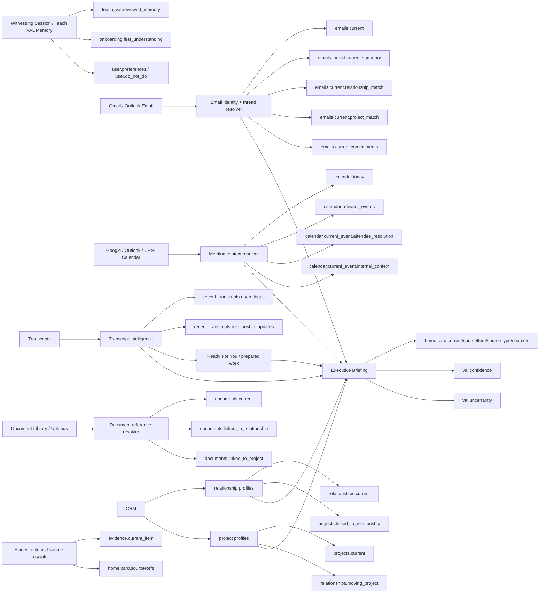
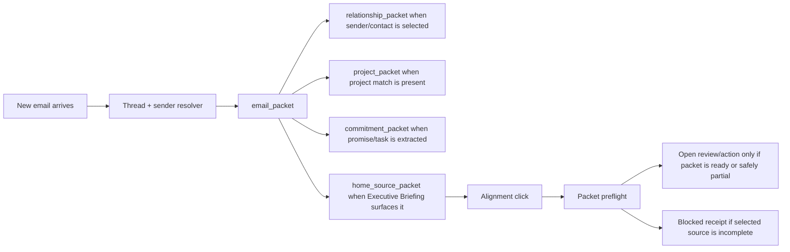
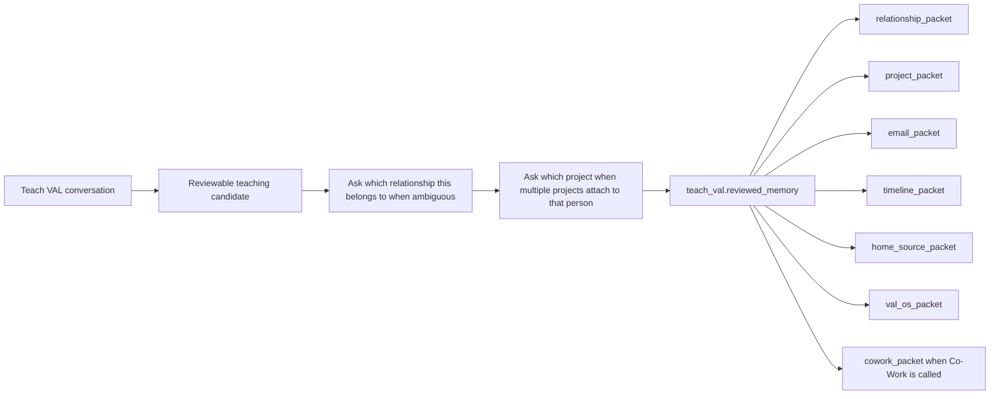

# Hearth Truth Lineage Map

Purpose: keep one living map of where each truth is born, which packet variable holds it, which click is allowed to use it, and what downstream surfaces it may feed.

This document is intentionally updateable. When a new click, packet variable, provider, or downstream consumer is added, update this map in the same change.

## Lineage Rule

Every meaningful click must be traceable as:

```text
truth source -> normalizer/provider -> packet variable -> click purpose -> prompt/rule -> visible action buttons -> receipt -> downstream packet updates
```

The truth line is broken when:

- A click opens a different entity than the card/row named.
- A variable is present only as generic fallback text.
- A packet uses relationship/project/email/calendar context that is not attached to the selected source.
- A button appears without being one of the suggested actions for that packet.
- A downstream packet receives a conclusion without the source receipt that created it.

Stewardship adds one executive-facing boundary: the user sees the clean Stewardship conclusion, not the internal packet machinery that produced it. Round Table notes, graph links, source-of-source details, confidence debug, and missing-variable lists belong in receipts or internal review surfaces, not the drawer itself.

## Current Enforcement Boundary

Server-hydrated and parity-tested packets:

- `relationship_packet`
- `project_packet`
- `email_packet`
- `timeline_packet`
- `home_source_packet`
- `workflow_scoped_packet`
- `val_os_packet`

Metadata-only packets until server hydration is added:

- `navigation_packet`
- `active_context_packet`
- `workspace_seed_packet`
- `source_navigation_packet`
- `home_state_packet`
- `home_presence_packet`
- `home_session_packet`
- `cowork_packet`
- `source_display_packet`
- `drawer_index_packet`
- `commitment_packet`
- `document_packet`
- `lead_intelligence_packet`
- `user_text_field_packet`

Metadata-only does not mean unimportant. It means the runtime click is annotated, but `/api/hearth/build-packet` does not yet hydrate that packet directly.

## Home Admission Boundary

Truth lineage is necessary, but it does not earn Home placement.

Before any truth appears in Velocity, Alignment, or Leverage, it must pass the v1 operating rule in `HEARTH_EXECUTIVE_REASONING_PIPELINE.md`:

- Velocity items must pass the Velocity Round Table.
- Alignment items must carry a complete Why Now Packet.
- Leverage items must carry a Prepared Work Packet and Can VAL Act status.

If an item lacks the required reasoning proof, it stays out of Home even when the source is true, packet-ready, and routeable.

Fallback drawer routing is a navigation guard only. It is not signal-quality proof and must not be used to justify Home admission.

Executive Inbox has an additional communication-specific contract in `VAL_EXECUTIVE_INBOX_ROUND_TABLE_AND_RULES.md`. That document defines the Executive Inbox Round Table, Email Admission Packet, Email Judgment Packet, Email Rule Packet, Draft Packet, External Action Packet, and downstream observer feed rules.

## Core Truth Graph



## Cross-Packet Flow Examples

### New Email Truth



Lineage requirement: an email-derived card must keep the email id/thread id, relationship match, project match, commitments, and source refs attached through every downstream packet.

### Teach VAL Truth



Lineage requirement: Teach VAL context should not silently attach everywhere. If entity scope is ambiguous, VAL must ask. Once reviewed and attached, the teaching travels with the relationship/project/email/calendar/document context it belongs to.

## Click Purpose Map

| Click purpose | Trigger family | Variable packet feeding click | Variables in that packet | Things that feed those variables |
|---|---|---|---|---|
| Return to VAL Home | `.val-mark` | `navigation_packet` | `teach_val.reviewed_memory`, `onboarding.first_understanding`, `user.preferences`, `val.do_not_do` | Witnessing Session, Teach VAL memory, working agreements |
| Close active context | `.return-button`, close buttons | `active_context_packet` | `teach_val.reviewed_memory`, `onboarding.first_understanding`, `evidence.current_item`, `val.review_only_mode` | Active workspace state, selected source receipt, Witnessing root |
| Static workspace action | `.workspace-card button`, `.workspace-actions button:not([data-workflow-action])` | `workspace_seed_packet` | `teach_val.reviewed_memory`, `onboarding.first_understanding`, `evidence.current_item`, `rules.val_os.behavior_packet` | Visible workspace, active source, VAL OS rules |
| Source navigation | `.source-action` | `source_navigation_packet` | `evidence.current_item`, `evidence.current_item.source_type`, `evidence.current_item.source_id`, `val.external_action_allowed` | Evidence table, selected source metadata, external action gates |
| Switch prototype state | `[data-state-option]` | `home_state_packet` | `onboarding.first_understanding`, `user.current_capacity_context`, `val.review_only_mode` | Witnessing root, browser state |
| Explain today | `.lean-button` | `home_presence_packet` | `teach_val.reviewed_memory`, `onboarding.first_understanding`, `calendar.today`, `recent_transcripts.capacity_and_tone_context`, `emails.thread.current.summary`, `tasks.open` | Executive Briefing, calendar, transcripts, email thread summaries, commitments |
| Fresh desk | `.fresh-desk-button` | `home_session_packet` | `user.id`, `val.review_only_mode`, `rules.val_os.behavior_packet` | Browser session, VAL OS rules |
| Calendar sidebar / meeting prep | `.next-meeting-card`, `.calendar-tab`, `.agenda-item`, `[data-calendar-event-index]` | `timeline_packet` | `teach_val.reviewed_memory`, `calendar.today`, `calendar.upcoming`, `calendar.current_event.attendee_resolution`, `calendar.current_event.internal_context`, `recent_transcripts.open_loops`, `emails.thread.current.summary`, `tasks.open` | Google/Outlook/CRM calendars, meeting resolver, transcript intelligence, email identity, commitments |
| Open Co-Work companion | `.cowork-notebook` | `cowork_packet` | `teach_val.reviewed_memory`, `onboarding.first_understanding`, `evidence.current_item`, `rules.val_os.behavior_packet`, `val.external_action_allowed` | Witnessing root, active workspace/source, evidence receipt, VAL OS rules |
| Teach VAL companion | `.teach-pen` | `val_os_packet` | `teach_val.reviewed_memory`, `teach_val.context_imports`, `onboarding.first_understanding`, `onboarding.connected_source_readiness`, `rules.val_os.behavior_packet`, `rules.val_os.approval_packet` | Witnessing Session, Teach VAL imports, connection status, VAL OS/external action gates |
| LinkedIn support visibility | `.linkedin-widget`, `[data-linkedin-copy]`, `[data-linkedin-link]` | `relationship_packet` | Relationship variables plus source receipts | Relationship profiles, support-circle teaching, LinkedIn prepared items, CRM identity |
| Velocity card | `.living-room .room-action[data-open-room="velocity"]` | `home_source_packet` | `teach_val.reviewed_memory`, `onboarding.first_understanding`, `home.card.current`, `home.card.sourceItem`, `home.card.sourceType`, `home.card.sourceId`, `home.card.sourceRefs`, `val.confidence`, `val.uncertainty` | Executive Briefing, source evidence, Ready For You, email/calendar/transcript/project/relationship signals |
| Alignment card | `.living-room .room-action[data-open-room="alignment"]` | `home_source_packet` | Same as `home_source_packet` | Executive Briefing highest leverage card and its source refs |
| Leverage card | `.living-room .room-action[data-open-room="leverage"]` | `home_source_packet` | Same as `home_source_packet` | Ready For You prepared work, drafts, transcript/email artifacts |
| Home source row | `[data-home-room-source]` | `source_display_packet` | `evidence.current_item.source_type`, `evidence.current_item.source_id`, `evidence.current_item.source_quote` | Source receipts attached to the Home queue item |
| Home dynamic action | `[data-home-action]` | `home_source_packet` | Same as `home_source_packet` plus clicked action | Active Home workspace, selected source item, homepage-card action contract |
| Drawer index open/close | `.drawer-pull`, `.close-all-drawers` | `drawer_index_packet` | `onboarding.connected_source_readiness`, `relationships.list`, `projects.active`, `calendar.today`, `tasks.open` | Connection status, relationship/project profiles, calendar, commitments |
| Stewardship drawer/index | `.relationship-drawer-link`, Stewardship filters/search/sort | `relationship_packet` or relationship index metadata | Stewardship variables, list state | Relationship profiles, CRM contact identity, linked projects/documents |
| Relationship row/profile | `[data-relationship-profile]`, `[data-relationship-open-profile]` | `relationship_packet` | `teach_val.reviewed_memory`, `onboarding.first_understanding`, `relationships.current`, `relationships.current.source_receipts`, `relationships.current.current_thread_history`, `projects.linked_to_relationship`, `emails.thread.current.summary`, `calendar.relevant_events`, `recent_transcripts.relationship_updates`, `documents.linked_to_relationship`, `tasks.open` | Relationship dossier, email identity, project links, meeting context, transcript intelligence, document references, commitments |
| Relationship action | `[data-relationship-action]`, `[data-relationship-pending-temperature-review]` | `relationship_packet` | Same as `relationship_packet` plus action id | Selected relationship, pending review update, source receipts |
| Project Managers drawer/index | `.project-drawer-link` | `project_packet` | Project variables, active project list | Project profiles, evidence, linked relationships/documents |
| Project row/profile | `[data-project-open-profile]` | `project_packet` | `teach_val.reviewed_memory`, `onboarding.first_understanding`, `projects.current`, `projects.current.blockers`, `projects.current.momentum`, `relationships.moving_project`, `emails.current.project_match`, `calendar.relevant_events`, `recent_transcripts.open_loops`, `documents.linked_to_project`, `tasks.open` | Project dossier, relationship index, email classifications, meeting context, transcripts, documents, commitments |
| Project action/review | `[data-project-action]`, `[data-project-review-update]` | `project_packet` | Same as `project_packet` plus action/review id | Selected project, source review update, linked graph |
| Timeline drawer | `.timeline-drawer-link` | `timeline_packet` | Timeline variables | Calendar providers, transcript proposal reviews, commitments |
| Timeline action/review | `[data-timeline-action]`, `[data-timeline-match-review]`, `[data-timeline-match-accept]`, `[data-timeline-review-action]` | `timeline_packet` | Timeline variables plus selected review id | Context debug, transcript proposal review, calendar event matching |
| Executive Inbox drawer/item/action | `.correspondence-drawer-link`, `[data-correspondence-item]`, `[data-correspondence-action]` | `email_packet` | `teach_val.reviewed_memory`, `emails.current`, `emails.thread.current.messages`, `emails.thread.current.summary`, `emails.current.relationship_match`, `emails.current.project_match`, `emails.current.commitments`, `relationships.current`, `projects.current`, `calendar.relevant_events`, `tasks.open`, `drafts.current` | Gmail/Outlook messages, email identity resolver, classifications, commitment extraction, project/relationship matching, drafts |
| Commitments drawer/filter/item/action | `.commitment-drawer-link`, `[data-commitment-item]`, `[data-commitment-filter]`, `[data-commitment-action]` | `commitment_packet` | `tasks.open`, `emails.current.commitments`, `calendar.relevant_events`, `recent_transcripts.open_loops`, `relationships.current`, `projects.current`, `val.external_action_allowed` | Commitment ledger, email extraction, transcripts, calendar, relationship/project links, approval gates |
| Documents drawer/filter/item/action | `.document-drawer-link`, `[data-document-item]`, `[data-document-action]`, document filters | `document_packet` | `documents.current`, `documents.linked_to_relationship`, `documents.linked_to_project`, `relationships.current`, `projects.current`, `emails.thread.current.summary`, `recent_transcripts.open_loops` | Document reference library, relationship/project links, email/transcript context |
| Lead Intelligence drawer/scraper/preview | `.source-drawer-link`, `[data-open-scraper]`, `[data-preview-choice]` | `lead_intelligence_packet` | `relationships.list`, `projects.active`, `crm.contacts`, `crm.opportunities`, `source_reviews.pending`, `val.external_action_allowed` | Lead preview endpoints, CRM mapping, source review state, approval choices |
| VAL drawer/actions/connections | `.val-drawer-link`, `[data-val-action]`, `[data-val-witnessing-file-input]`, `[data-google-oauth]` | `val_os_packet` | VAL OS variables | Witnessing Session, Teach VAL imports, Google/Microsoft/CRM connection status, runtime/OpenAI status, approval rules |
| Shared workflow action | `[data-workflow-action]` | `workflow_scoped_packet` unless a specific packet overrides it | `teach_val.reviewed_memory`, `event.type`, `evidence.current_item`, `rules.val_os.behavior_packet`, `val.external_action_allowed` | Click node action, active source item, evidence receipts, VAL OS rules |
| Workspace tools | `[data-workspace-tool]`, `[data-workspace-file-input]`, `[data-workspace-prompt-copy]` | `cowork_packet` | Co-Work variables | Active workspace/source, uploaded files, prompt card content |
| Autocorrect suggestion | `.val-autocorrect button` | `user_text_field_packet` | `user.communication_style`, `user.do_not_sound_like`, `val.do_not_do` | Current typed field, Witnessing voice/style rules |

## Server-Hydrated Packet Variable Lineage

### `home_source_packet`

| Variable | Things that feed it | Downstream surfaces it feeds |
|---|---|---|
| `{{teach_val.reviewed_memory}}` | `listTeachValCoreMemory({limit:120})` | Home cards, Home actions, Co-Work posture, review boundaries |
| `{{onboarding.first_understanding}}` | `buildExecutiveBriefing().onboardingReflection` | Home meaning, recommendation language, action boundaries |
| `{{home.card.current}}` | `buildExecutiveBriefing()` selected card | Velocity, Alignment, Leverage |
| `{{home.card.sourceItem}}` | Selected Home card/source payload | Source view, Home action payloads |
| `{{home.card.sourceType}}` | Selected card `source_type/sourceType` | Source routing, evidence display |
| `{{home.card.sourceId}}` | Selected card `source_id/sourceId/id` | Source routing, packet preflight matching |
| `{{home.card.sourceRefs}}` | Card evidence/sourceRefs, evidence item lookup | Packet receipt, source-of-source display |
| `{{val.confidence}}` | Card confidence from Executive Briefing | User-facing trust posture |
| `{{val.uncertainty}}` | Briefing unknowns/fail-closed packet receipt | Block/partial explanation, review-only posture |

### `relationship_packet`

| Variable | Things that feed it | Downstream surfaces it feeds |
|---|---|---|
| `{{teach_val.reviewed_memory}}` | Witnessing Session, Teach VAL reviewed memory | Relationship interpretation, Co-Work, email/project context |
| `{{onboarding.first_understanding}}` | Executive Briefing onboarding reflection | Relationship judgment boundaries |
| `{{relationships.current}}` | Stewardship profile/dossier matched by contact/person/source id | Stewardship drawer, Home source, email sender matching, project graph |
| `{{relationships.current.source_receipts}}` | Relationship dossier timeline/source refs | Relationship detail, action receipt |
| `{{relationships.current.current_thread_history}}` | Email identity/thread context | Relationship temperature, email review |
| `{{projects.linked_to_relationship}}` | Project link resolver, project profiles | Project packet, relationship graph |
| `{{emails.thread.current.summary}}` | Email identity/conversation context | Relationship brief, Co-Work, Home Alignment |
| `{{calendar.relevant_events}}` | Meeting context resolver | Timeline, meeting prep, relationship touchpoints |
| `{{recent_transcripts.relationship_updates}}` | Transcript intelligence/evidence observations | Relationship updates, commitments, project context |
| `{{documents.linked_to_relationship}}` | Document reference resolver | Document drawer, relationship file |
| `{{tasks.open}}` | Commitment ledger | Commitment packet, follow-through actions |

### `project_packet`

| Variable | Things that feed it | Downstream surfaces it feeds |
|---|---|---|
| `{{teach_val.reviewed_memory}}` | Witnessing Session, Teach VAL reviewed memory | Project judgment, Co-Work, relationship graph |
| `{{onboarding.first_understanding}}` | Executive Briefing onboarding reflection | Project priority boundaries |
| `{{projects.current}}` | Project profile/dossier matched by project/source id | Project drawer, Home source, relationship links |
| `{{projects.current.blockers}}` | Project dossier/source reviews | Project priority/actions |
| `{{projects.current.momentum}}` | Project dossier + Executive Briefing | Velocity/Leverage surfacing |
| `{{relationships.moving_project}}` | Relationship index and project links | Relationship packet, intro/support actions |
| `{{emails.current.project_match}}` | Email classifications/evidence target metadata | Email packet, project brief |
| `{{calendar.relevant_events}}` | Meeting context/project links | Timeline, meeting prep |
| `{{recent_transcripts.open_loops}}` | Transcript intelligence | Commitments, project tasks |
| `{{documents.linked_to_project}}` | Document reference resolver | Document drawer, project file |
| `{{tasks.open}}` | Commitment ledger | Commitment packet, task actions |

### `email_packet`

| Variable | Things that feed it | Downstream surfaces it feeds |
|---|---|---|
| `{{teach_val.reviewed_memory}}` | Witnessing Session, Teach VAL reviewed memory | Email tone/boundaries, relationship/project matching |
| `{{emails.current}}` | Email message/draft/current source | Executive Inbox, Home Alignment |
| `{{emails.thread.current.messages}}` | Email provider/thread resolver | Draft generation/revision |
| `{{emails.thread.current.summary}}` | Conversation context builder | Relationship packet, project packet, timeline |
| `{{emails.current.relationship_match}}` | Identity resolver/CRM contact match | Relationship packet |
| `{{emails.current.project_match}}` | Classification/evidence metadata | Project packet |
| `{{emails.current.commitments}}` | Commitment extraction from email | Commitment packet |
| `{{relationships.current}}` | Relationship dossier/profile match | Email review, reply tone |
| `{{projects.current}}` | Project dossier/profile match | Project-specific reply/action |
| `{{calendar.relevant_events}}` | Meeting context resolver | Meeting prep/follow-up |
| `{{tasks.open}}` | Commitment ledger | Create task/follow-up |
| `{{drafts.current}}` | `listDrafts()` / Ready For You draft artifacts | Draft review/send packet |

### `timeline_packet`

| Variable | Things that feed it | Downstream surfaces it feeds |
|---|---|---|
| `{{teach_val.reviewed_memory}}` | Witnessing Session, Teach VAL reviewed memory | Meeting prep boundaries, contact decisions |
| `{{calendar.today}}` | Calendar provider data | Calendar sidebar, Home presence |
| `{{calendar.upcoming}}` | Calendar provider data | Calendar sidebar |
| `{{calendar.current_event.attendee_resolution}}` | Meeting context resolver | Contact candidate review, relationship packet |
| `{{calendar.current_event.internal_context}}` | Meeting prep/context resolver | Meeting prep workspace, follow-up |
| `{{recent_transcripts.open_loops}}` | Transcript intelligence | Timeline review, commitments |
| `{{emails.thread.current.summary}}` | Email identity/conversation context | Meeting prep, relationship context |
| `{{tasks.open}}` | Commitment ledger | Timeline & Tasks drawer |

### `workflow_scoped_packet`

| Variable | Things that feed it | Downstream surfaces it feeds |
|---|---|---|
| `{{teach_val.reviewed_memory}}` | Witnessing Session, Teach VAL reviewed memory | All workflow dispatch decisions |
| `{{event.type}}` | Click action / workflow action | Dispatch routing |
| `{{evidence.current_item}}` | Active source item, Home card, evidence lookup | Workflow-specific context |
| `{{rules.val_os.behavior_packet}}` | VAL OS behavior contract | Review-only/approval rules |
| `{{val.external_action_allowed}}` | External action approval gates | Send/import/update protection |

### `val_os_packet`

| Variable | Things that feed it | Downstream surfaces it feeds |
|---|---|---|
| `{{teach_val.reviewed_memory}}` | Teach VAL memory store | VAL drawer, Co-Work, all action packets |
| `{{teach_val.context_imports}}` | Import/witness/onboarding memory items | Witnessing resume/import review |
| `{{onboarding.first_understanding}}` | Executive Briefing onboarding reflection | Partnership promise and OS review |
| `{{onboarding.connected_source_readiness}}` | Google/Microsoft/CRM connection status helpers | Connections UI, source readiness |
| `{{rules.val_os.behavior_packet}}` | VAL OS instruction/compiler contract | Runtime behavior boundaries |
| `{{rules.val_os.approval_packet}}` | External action packet gate | Send/import/update approvals |

## Update Checklist

When we add or change a truth line:

1. Add the truth source.
2. Name the normalizer/provider.
3. Add or update the packet variable.
4. Add every click purpose that can call that packet.
5. Add downstream packets/surfaces that receive the truth.
6. Add the receipt/approval boundary.
7. Add a test or audit check if the line is server-enforced.
