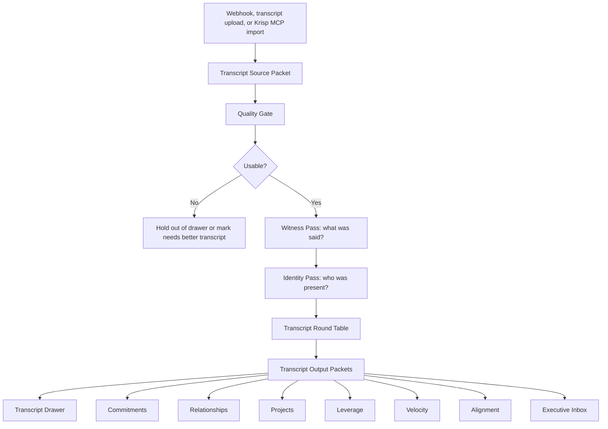

# VAL Transcript Evidence Engine v1

Purpose: define the transcript drawer, transcript intake pipeline, round tables, packets, and downstream feed map.

This document is the source of truth for the Hearth transcript drawer. It replaces the mixed "Timeline & Tasks" mental model for this surface.

## Core Rule

The transcript drawer is only for transcripts and what transcripts do.

It is not a calendar drawer.
It is not a generic timeline.
It is not a task board.
It is not a review/debug surface.

Transcripts are the real-time evidence spine of VAL. A transcript is where VAL learns what was actually said, what changed, what was promised, what should be prepared, and which other parts of VAL must update.

## v1 Admission Rule

Only these records may appear in the transcript drawer:

1. A transcript received through the transcript webhook.
2. A transcript uploaded by the user as a transcript.
3. A transcript imported from a supported transcript source, such as Krisp or Zoom, with transcript text attached.

Krisp MCP is a supported transcript source. It is a Transcript Witness connector, not a VAL reasoning engine.

Krisp may provide meeting document IDs, transcripts, summaries, key points, action items, participants, and upcoming meeting references. VAL must treat Krisp output as source evidence. Krisp action items are candidate evidence only; they do not become final VAL action items until the Transcript Round Table validates them against the full transcript and routes them through VAL packets.

These records must not appear as transcript rows:

1. Calendar-only events.
2. Meeting prep records.
3. Chat memory.
4. Generic VAL memory.
5. Empty webhook receipts with no transcript text.
6. Planning artifacts.
7. Debug records.

Calendar events may link to transcripts. Calendar events may never create transcript rows by themselves.

Calendar-only Krisp records, upcoming meetings, Activity Center notifications, and empty documents must not create transcript rows.

## Product Standard

The transcript drawer should feel simpler than Krisp and more powerful underneath.

The user-facing surface should show:

1. A clean list of transcripts, most recent first.
2. A transcript detail view that starts with action items and the meeting overview.
3. A clear button to view the full transcript.
4. A simple way to connect unmatched participants to existing or new relationships.
5. Co-Work scoped to either all transcripts or one selected transcript.

The user-facing surface must not show:

1. Processing architecture.
2. Packet names.
3. Round Table reasoning.
4. Debug copy.
5. Calendar review workflow.
6. Internal evidence IDs unless the user is in an explicit developer/audit mode.

## Transcript Drawer UX

### Transcript Index

Purpose: let the user scan real conversations quickly.

The first screen shows a list of real transcript records sorted newest first.

Each row should show:

- title
- date and time
- duration when known
- participants when known
- number of action items
- number of drafts/prepared work items
- linked relationship or project badges when known
- match status only when action is needed

Primary Co-Work context:

> Ask across all transcripts.

This Co-Work may search across all transcript summaries, tasks, decisions, and evidence, but it must not expose raw context unless explicitly requested.

### Transcript Detail

Purpose: show what VAL made useful from one conversation.

The first screen for a selected transcript shows:

1. Action Items
2. Meeting Overview
3. Decisions
4. Open Questions
5. Relationship and project links
6. Prepared work created from the transcript
7. Button: View full transcript

The full transcript is secondary. The user should not have to read the transcript to know what matters.

Transcript-scoped Co-Work context:

> Work from this transcript only.

When a transcript is open, Co-Work may use only:

- the selected transcript
- its extracted tasks
- its extracted decisions
- its participants
- its prepared work
- its relationship/project links
- source evidence for that transcript

It must not blend in unrelated transcripts, emails, calendar events, relationships, or projects unless the user asks to compare or connect them.

## Transcript Intake Pipeline

Every admitted transcript follows this pipeline:

## Witness Pass

Question:

> What actually happened in this conversation?

The Witness Pass extracts facts only.

It may identify:

- speakers
- participants
- stated topics
- direct requests
- explicit commitments
- decisions
- deadlines
- named projects
- named people
- documents, links, or systems mentioned
- moments where the transcript quality is uncertain

It must not decide whether something matters.
It must not create a task.
It must not update a relationship.
It must not infer beyond the words spoken.

## Transcript Round Table

Question:

> What changed because this conversation happened?

The Transcript Round Table receives the Witness Packet and creates downstream packets.

Participants:

- Commitment Observer
- Task Observer
- Decision Observer
- Relationship Observer
- Project Observer
- Prepared Work Observer
- Meeting Overview Observer
- Identity Observer
- Executive Relevance Observer
- Safety and Approval Observer

Each observer has one job.

No observer may produce UI copy that exposes internal reasoning. Every output must be usable by a human executive.

## Required Packets

### Transcript Source Packet

Created immediately when a transcript arrives.

Fields:

- transcript_id
- source_type
- source_name
- external_document_id
- received_at
- title
- raw_text_present
- duration
- speaker_turns_present
- payload_receipt

This packet proves that the transcript exists. It does not prove that the transcript is useful.

For Krisp MCP, `external_document_id` is the Krisp document ID. Krisp document IDs must be stored without dashes and must remain linked to the transcript record so VAL can re-fetch or audit the source if needed.

## Krisp MCP Operating Rule

Krisp is allowed to answer:

> What meeting data exists in Krisp?

Krisp is not allowed to answer:

> What should the user do?

VAL owns the second question.

When importing from Krisp:

1. Search or receive the Krisp document ID.
2. Fetch the full document through Krisp MCP.
3. Import only if transcript text is present.
4. Save the transcript with `source=krisp_mcp`.
5. Preserve Krisp summaries and action items in metadata as evidence.
6. Run the normal VAL Transcript Round Table.
7. Route only VAL-approved outputs to Commitments, Projects, Relationships, Leverage, Home, and Co-Work.

### Transcript Quality Packet

Answers:

> Can VAL safely process this transcript?

Fields:

- usable
- quality
- speaker_confidence
- transcript_completeness
- issues
- recommended_next_step

Unusable transcripts do not feed drawers, cards, tasks, projects, relationships, or memory.

### Transcript Identity Packet

Answers:

> Who is in this conversation, and what is still unresolved?

Fields:

- participants
- matched_relationships
- unresolved_participants
- candidate_relationships
- candidate_projects
- confidence

If a participant cannot be matched, the transcript detail shows one simple action:

> Connect this person

That opens a clean list of relationships and an option to create a new relationship.

### Meeting Overview Packet

Answers:

> What should someone know without reading the transcript?

Fields:

- title
- short_summary
- key_points
- decisions
- open_questions
- follow_up_context
- attendee_safe_overview

The attendee-safe overview is the version that may be sent externally. It must exclude internal VAL relationship analysis, private user context, and any commentary not meant for attendees.

### Transcript Task Packet

Answers:

> What work was created by this conversation?

Fields:

- task_id
- task_title
- owner
- due_date
- source_quote
- source_timestamp
- related_relationships
- related_projects
- commitment_type
- why_it_matters
- draft_needed
- draft_status
- approval_required

A task is not complete unless it can answer:

- who owns it
- what needs to happen
- why it matters
- where it belongs
- what source created it
- whether VAL can prepare anything before asking the user

### Prepared Work Packet

Answers:

> What can VAL draft or prepare because of this transcript?

Fields:

- prepared_work_id
- work_type
- trigger_task_id
- trigger_quote
- draft_body
- recipient_or_destination
- related_relationship
- related_project
- approval_status
- can_val_act_status
- execution_receipt

Prepared work feeds Leverage.

If the transcript creates a follow-up email, VAL should draft it and place it in Leverage for approval or send it automatically only when an explicit user-approved rule allows it.

### Transcript Relationship Feed Packet

Answers:

> What should the relationship dossier learn from this conversation?

Fields:

- relationship_id
- transcript_id
- signal_type
- what_changed
- why_it_matters
- evidence_quote
- timestamp
- temperature_change
- trust_change
- open_loops
- follow_up_needed

This packet feeds Relationships.

### Transcript Project Feed Packet

Answers:

> What should the project manager learn from this conversation?

Fields:

- project_id
- transcript_id
- project_signal_type
- project_update
- decision
- blocker
- owner
- next_action
- related_people
- evidence_quote
- timestamp
- sop_implication

This packet feeds Projects.

### Transcript Commitment Feed Packet

Answers:

> Who owes whom what, by when?

Fields:

- commitment_id
- owner
- recipient
- action
- due_date
- source_quote
- timestamp
- relationship_id
- project_id
- status
- prepared_work_id

This packet feeds Commitments and may also feed Alignment when the commitment is urgent or blocking.

### Transcript Home Feed Packet

Answers:

> Does this transcript deserve Home attention?

Fields:

- velocity_items
- alignment_candidates
- leverage_items
- why_now
- executive_relevance_score

Home may only show transcript-derived items that pass the appropriate Home round table:

- Velocity: something meaningful changed.
- Alignment: this is the highest-priority thing to do.
- Leverage: VAL prepared work that is ready for approval or execution.

## Downstream Feed Map

| Transcript extraction | Feeds | Rule |
| --- | --- | --- |
| Action item | Commitments | Always create a commitment candidate with owner, source quote, and relationship/project links when known. |
| Action item with draftable output | Leverage | Create a Prepared Work Packet and wait for approval unless an approved automation rule exists. |
| Urgent/blocking action item | Alignment | Only if it has a complete Why Now Packet. |
| Meaningful project update | Projects | Update the project manager packet, active phase, blocker, next move, or SOP implication. |
| Project-like repeated work | Projects | Create or update a project candidate only when project admission rules are met. |
| Relationship signal | Relationships | Update relationship understanding, recent activity, open loops, trust, risk, or executive advice. |
| Unmatched person | Transcript detail and Relationships | Show connect/create relationship action; do not silently attach to the wrong person. |
| Decision | Projects, Relationships, Memory | Store as a decision with source proof and downstream effects. |
| Open question | Commitments or Alignment | Feed follow-up only if a person owns the question or it blocks progress. |
| Attendee-safe overview | Executive Inbox or Leverage | Prepare overview to attendees; send only with approval or rule. |
| Internal insight | Relationship/Project packet | Keep private. Do not include in attendee overview. |
| Nothing changed | Transcript archive only | Show the transcript, but do not feed Home, Commitments, Projects, Relationships, or Leverage. |

## Overview Sending Rule

VAL may automatically create an attendee-safe overview from a transcript.

VAL may send that overview to attendees only when one of these is true:

1. The user approves the specific overview.
2. The user has created a standing rule for that meeting type, attendee group, project, or relationship.

The overview is sent to attendees, not back to the user by default.

The user should see a receipt, not a wall of processing context:

> Overview sent to attendees.

or

> Overview prepared for approval.

## Relationship Connection Rule

If a transcript participant matches a known relationship confidently, VAL links it automatically.

If confidence is uncertain, VAL asks simply:

> Who is this?

The interface shows:

1. Suggested existing relationships.
2. Search existing relationships.
3. Create new relationship.
4. Leave unmatched for now.

No downstream relationship or project updates may be committed for an uncertain person until the identity is resolved.

## Project Connection Rule

If a transcript names or clearly belongs to a project, VAL links it to that project.

If the transcript appears project-like but no project exists, VAL creates a project candidate only when project admission rules are met:

- explicit user says this is a project
- repeated work exists
- tasks exist
- decisions exist
- documents exist
- CRM opportunity exists
- pipeline/won opportunity exists

Otherwise, it remains conversation evidence.

## Task and Draft Rule

When a transcript creates a task, VAL should ask:

1. Is this a real commitment or only a possible idea?
2. Who owns it?
3. Is there a due date or review date?
4. Does it belong to a relationship?
5. Does it belong to a project?
6. Can VAL draft anything now?
7. Does sending or executing require approval?

If draftable, VAL prepares the draft immediately and feeds Leverage.

If not draftable, VAL creates the commitment only.

If required fields are missing, VAL asks for the minimum missing information inside the transcript detail, not in a generic task workflow.

## Layered Output Rules

Transcript processing must not use one broad "extract tasks and summary" prompt.

It runs three distinct reasoning pipelines.

### Action Items Pipeline

1. Witness what was actually said.
2. Classify candidate statements as:
   - explicit task
   - promise
   - request
   - delegation
   - strongly implied commitment
   - idea
   - question
   - decision
   - preference
   - logistics
   - small talk
   - background context
3. Keep an action item only when it has:
   - a real actor or owner
   - a concrete action verb
   - an object or outcome
   - an exact source quote
   - enough confidence that someone is expected to do something
4. Rewrite the action item in project-manager language.
5. Route it.

A transcript snippet is not an action item just because it sounds actionable.

### Action Item Routing

Every accepted action item feeds:

1. The transcript detail Action Items section.
2. The Commitments drawer.
3. The Project Manager.

It feeds Leverage only when VAL has created a draft or prepared artifact from that action item.

Leverage is not a task list. Leverage is prepared work plus approval-to-execute.

### Overview Pipeline

1. Identify the agenda sections.
2. Remove small talk, jokes, repeated phrases, and transcript noise.
3. Group by business topic.
4. Summarize:
   - what was discussed
   - what changed
   - why it matters
   - what needs follow-up

The overview should never be a pile of transcript snippets.

### Decisions Pipeline

1. Extract only moments where a choice, policy, operating rule, or direction was actually set.
2. Do not treat questions, ideas, concerns, or agenda topics as decisions.
3. Each decision must include:
   - decision
   - implication
   - source quote
   - affected project or relationship when known

Decisions are not the same thing as action items.

## User-Facing Language Standard

Use plain transcript language:

- Action Items
- Meeting Overview
- Decisions
- Open Questions
- People
- Projects
- Prepared Follow-Up
- View Full Transcript
- Connect this person

Do not use:

- Timeline workflow
- Proposed notes
- Review boundary
- Source proof
- Packet receipt
- Evidence spine
- Processing status
- Ready to extract
- Needs matching

Those concepts are real internally, but they do not belong in the normal user interface.

## Diagnostic Boundary

Webhook receipts, empty transcript payloads, migration tools, repair tools, processing failures, and raw storage counts belong in Developer/Admin diagnostics only.

The normal transcript drawer should never make the user debug ingestion.

If a transcript the user expects is missing, the normal UI may show:

> I do not see that transcript yet.

Then offer:

> Check transcript intake

That opens a developer/admin diagnostic screen, not the ordinary drawer.

## Implementation Checklist

1. Rename the Hearth drawer from "Timeline & Tasks" to "Transcripts".
2. Change the drawer description to "Meeting notes, action items, and follow-up."
3. Remove calendar-only events from the transcript list.
4. Remove internal workflow cards from the transcript drawer.
5. Render transcript rows from `/api/val/transcripts` only.
6. Sort newest first.
7. Make transcript detail default to action items and meeting overview.
8. Add "View full transcript" as the secondary path.
9. Scope Co-Work to all transcripts on the index and one transcript on detail.
10. Add relationship connect/create flow for unresolved participants.
11. Ensure transcript-created tasks feed Commitments.
12. Ensure transcript-created drafts feed Leverage.
13. Ensure relationship signals feed Relationships.
14. Ensure project signals feed Projects.
15. Ensure transcript-derived Home items pass Home round tables before surfacing.
16. Move diagnostics to developer/admin only.
